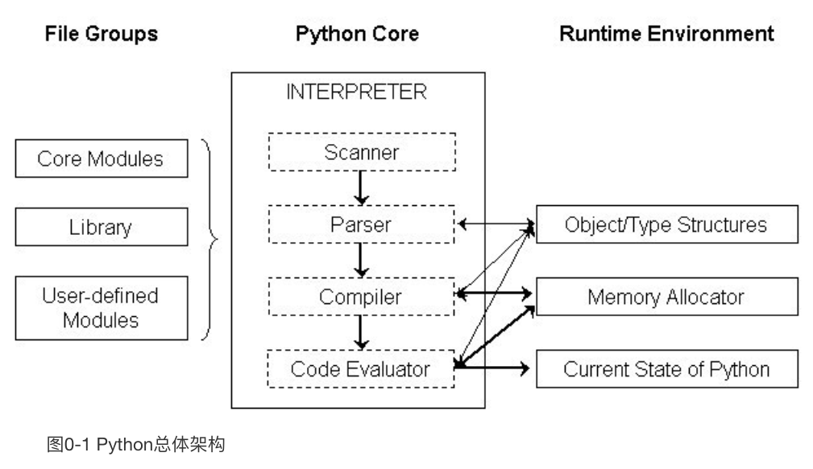
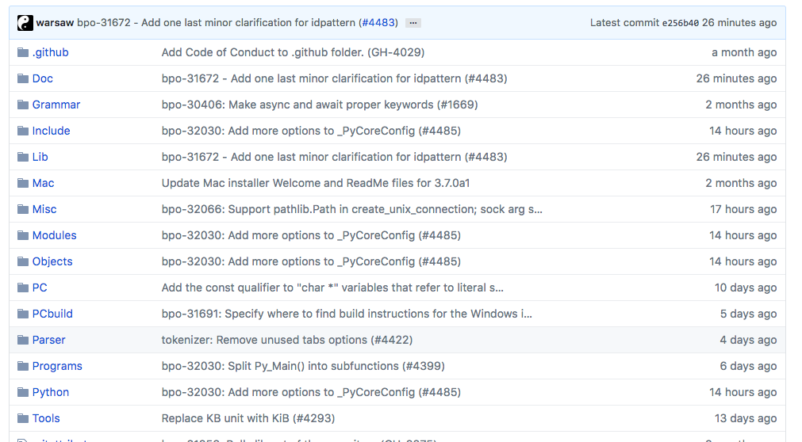
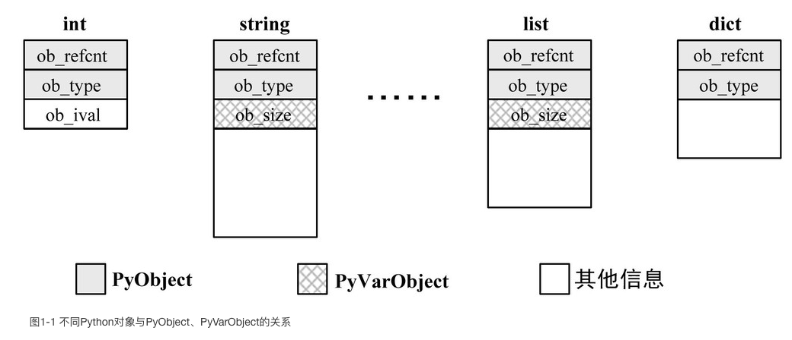
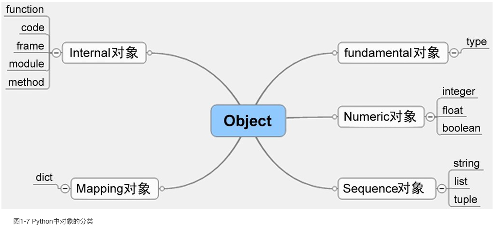

# Python 源码学习  

## 0. 编译Python
### 0.1 Python 总体架构

### 0.2 Python 的源码组织

- Include ：该目录下包含了Python提供的所有头文件，如果用户需要自己用C或C++来编写自定义模块扩展Python，那么就需要用到这里提供的头文件。
- Lib ：该目录包含了Python自带的所有标准库，Lib中的库都是用Python语言编写的。
- Modules ：该目录中包含了所有用C语言编写的模块，比如random、cStringIO等。Modules中的模块是那些对速度要求非常严格的模块。
- Parser ：该目录中包含了Python解释器中的Scanner和Parser部分，即对Python源代码进行词法分析和语法分析的部分。
- Objects ：该目录中包含了所有Python的内建对象，包括整数、list、dict等。同时，该目录还包括了Python在运行时需要的所有的内部使用对象的实现。
- Python ：该目录下包含了Python解释器中的Compiler和执行引擎部分，是Python运行的核心所在。

### 0.5 修改Python源码  
#### 调试技巧：输出Python对象
<pre><code>
[object.h]
int PyObject_Print(PyObject *, FILE *, int);
</code></pre>
例如：
<pre><code>
[intobject.c]
static int int_print(PyIntObject *v, FILE *fp, int flags)
{
  //add by Robert
  PyObject* str = PyString_FromString(“i am in int_print”);
  PyObject_Print(str, stdout, 0);
  printf(“\n”);

  fprintf(fp, "%ld", v->ob_ival);
  return 0;
}
</code></pre>

 
## 1. Python对象初探

关键词：类型对象、实例对象、内建类型对象、内建类型对象的实例对象  

### 1.1 Python内的对象
> 在Python中，对象就是为C中的结构体在堆上申请的一块内存，一般来说，对象是不能被静态初始化的，并且也不能在栈空间上生存。唯一的例外就是类型对象，Python中所有的内建的类型对象（如整数类型对象，字符串类型对象）都是被静态初始化的。  

>> 栈负责保存我们的代码执行（或调用）路径,而堆则负责保存对象（或者说数据，接下来将谈到很多关于堆的问题）的路径。
—— [关于堆和栈，这里有个不错的解释](http://www.cnblogs.com/tianzhiliang/archive/2010/09/19/1830763.html)

#### 1.1.1 对象机制的基石——PyObject
> 在源码的*Include/object.h*里有更多关于Python对象的解释  

PyObject是整个Python对象机制的核心:
<pre><code>
[object.h]
82 /* PyObject_HEAD defines the initial segment of every PyObject. */
83 #define PyObject_HEAD                   PyObject ob_base;
...
101 /* Nothing is actually declared to be a PyObject, but every pointer to
102  * a Python object can be cast to a PyObject*.  This is inheritance built
103  * by hand.  Similarly every pointer to a variable-size Python object can,
104  * in addition, be cast to PyVarObject*.
105  */
106 typedef struct _object {
107     _PyObject_HEAD_EXTRA
108     Py_ssize_t ob_refcnt;         // 引用计数
109     struct _typeobject *ob_type;  // 类型信息
110 } PyObject;
</code></pre>
> 在Python中，对象机制的核心其实非常简单，一个是引用计数，一个就是类型信息。

> 在PyObject中定义了每一个Python对象都必须有的内容，这些内容将出现在每一个Python对象所占有的内存的最开始的字节中。

比如，Float对象：
<pre><code>
15 typedef struct {
16     PyObject_HEAD
17     double ob_fval;
18 } PyFloatObject;
</code></pre>
*书中用int类型来举例，但是在Python3之后可能发生了点变化。*  
> [Python3中的整数对象并入Long对象](https://zhuanlan.zhihu.com/p/27652878?utm_source=wechat_session&utm_medium=social)

PyLong_Type对象中的tp_name="int":
<pre><code>
PyTypeObject PyLong_Type = {
    PyVarObject_HEAD_INIT(&PyType_Type, 0)
    "int",                                      /* tp_name */
    offsetof(PyLongObject, ob_digit),           /* tp_basicsize */
    ...
    long_new,                                   /* tp_new */
    PyObject_Del,                               /* tp_free */
};
</code></pre>

#### 1.1.2 定长对象和变长对象  
> 我们把整数对象这样不包含可变长度数据的对象称为**定长对象**，而字符串对象这样包含可变长度数据的对象称为**变长对象**，它们的区别在于定长对象的不同对象占用的内存大小是一样的，而变长对象的不同对象占用的内存可能是不一样的。

*在Python3中，由于PyIntObject对象并入PyLongObject，整数对象不再是定长对象。*

Python中，用PyVarObject结构体表示变长对象：
<pre><code>
typedef struct {
    PyObject ob_base;
    Py_ssize_t ob_size; /* Number of items in variable part */
} PyVarObject;
</code></pre>

### 1.2类型对象  
> 占用内存空间的大小是对象的一种元信息，这样的元信息是与对象所属类型密切相关的，因此它一定会出现在与对象所对应的类型对象中。  
一个PyTypeObject对象就是Python中对面向对象理论中“类”这个概念的实现

类型对象定义：
<pre><code>
typedef struct _typeobject {
    PyObject_VAR_HEAD
    const char *tp_name; /* For printing, in format "<module>.<name>" */
    Py_ssize_t tp_basicsize, tp_itemsize; /* For allocation */

    /* Methods to implement standard operations */

    destructor tp_dealloc;
    printfunc tp_print;
    getattrfunc tp_getattr;
    setattrfunc tp_setattr;
    ...
} PyTypeObject;
</code></pre>

#### 1.2.1 对象的创建
#### 1.2.2 对象的行为
#### 1.2.3 类型的类型  

### 1.3 Python对象的多态性
>Python内部各个函数之间传递的都是一种范型指针——PyObject*。这个指针所指的对象究竟是什么类型的，我们不知道，只能从指针所指对象的ob_type域动态进行判断，而正是通过这个域，Python实现了多态机制。

<pre><code>
void Print(PyObject* object)
{
  object->ob_type->tp_print(object);
}
</pre></code>

### 1.4 引用计数

### 1.5 Python对象的分类
> 我们将Python的对象从概念上大致分为5类
- Fundamental对象：类型对象
- Numeric对象：数值对象
- Sequence对象：容纳其他对象的序列集合对象
- Mapping对象：类似于C++中map的关联对象
- Internal对象：Python虚拟机在运行时内部使用的对象

## 2. Python中带整数对象
### 2.1 初识PyIntObject对象(PyLongObject)
在Python3中，PyIntObject已经并入PyLongObject
<pre><code>
PyTypeObject PyLong_Type = {
    PyVarObject_HEAD_INIT(&PyType_Type, 0)
    "int",                                      /* tp_name */
    offsetof(PyLongObject, ob_digit),           /* tp_basicsize */
    ...
    long_new,                                   /* tp_new */
    PyObject_Del,                               /* tp_free */
};
</code></pre>
PyLongObject对象的定义:
<pre><code>
struct _longobject {
    PyObject_VAR_HEAD
    digit ob_digit[1];
};
</code></pre>
PyLongObject所支持的操作
|||
|----|----|
|long_dealloc           |Python对象的析构操作 |
|long_to_decimal_string |转换成PyUnicoObject(Python3)|
|long_hash              |获取HASH值|
|long_richcompare       |比较操作|
|long_as_number         |数值操作集合|
|long_methods           |成员函数集合|

看看如何比较两个PyLongObject：
<pre><code>
 2916 long_richcompare(PyObject *self, PyObject *other, int op)
 2917 {
 2918     int result;
 2919     CHECK_BINOP(self, other);     // 检查是否是PyLong
 2920     if (self == other)            // 是否指向同一个对象
 2921         result = 0;
 2922     else
 2923         result = long_compare((PyLongObject*)self, (PyLongObject*)other);   // 进行PyLongObject数据的比较
 2924     Py_RETURN_RICHCOMPARE(result, 0, op);
 2925 }

 2892 static int
 2893 long_compare(PyLongObject *a, PyLongObject *b)
 2894 {
 2895     Py_ssize_t sign;
 2896 
 2897     if (Py_SIZE(a) != Py_SIZE(b)) {
 2898     ¦   sign = Py_SIZE(a) - Py_SIZE(b);
 2899     }
 2900     else {
 2901     ¦   Py_ssize_t i = Py_ABS(Py_SIZE(a));
 2902     ¦   while (--i >= 0 && a->ob_digit[i] == b->ob_digit[i])
 2903     ¦   ¦   ;
 2904     ¦   if (i < 0)
 2905     ¦   ¦   sign = 0;
 2906     ¦   else {
 2907     ¦   ¦   sign = (sdigit)a->ob_digit[i] - (sdigit)b->ob_digit[i];
 2908     ¦   ¦   if (Py_SIZE(a) < 0)
 2909     ¦   ¦   ¦   sign = -sign;
 2910     ¦   }
 2911     }
 2912     return sign < 0 ? -1 : sign > 0 ? 1 : 0;
 2913 }
 2914 
</code></pre>

## 参考  
1. [<<Python源码解析>>](https://read.douban.com/reader/ebook/1499455/)