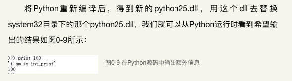

# Python 源码学习  

## 0. 编译Python
### 0.1 Python 总体架构

### 0.2 Python 的源码组织

- Include ：该目录下包含了Python提供的所有头文件，如果用户需要自己用C或C++来编写自定义模块扩展Python，那么就需要用到这里提供的头文件。
- Lib ：该目录包含了Python自带的所有标准库，Lib中的库都是用Python语言编写的。
- Modules ：该目录中包含了所有用C语言编写的模块，比如random、cStringIO等。Modules中的模块是那些对速度要求非常严格的模块。
- Parser ：该目录中包含了Python解释器中的Scanner和Parser部分，即对Python源代码进行词法分析和语法分析的部分。
- Objects ：该目录中包含了所有Python的内建对象，包括整数、list、dict等。同时，该目录还包括了Python在运行时需要的所有的内部使用对象的实现。
- Python ：该目录下包含了Python解释器中的Compiler和执行引擎部分，是Python运行的核心所在。

### 0.5 修改Python源码  
#### 调试技巧：输出Python对象
<pre><code>
[object.h]
int PyObject_Print(PyObject *, FILE *, int);
</code></pre>
例如：
<pre><code>
[intobject.c]
static int int_print(PyIntObject *v, FILE *fp, int flags)
{
  //add by Robert
  PyObject* str = PyString_FromString(“i am in int_print”);
  PyObject_Print(str, stdout, 0);
  printf(“\n”);

  fprintf(fp, "%ld", v->ob_ival);
  return 0;
}
</code></pre>

 

## 参考  
1. [<<Python源码解析>>](https://read.douban.com/reader/ebook/1499455/)